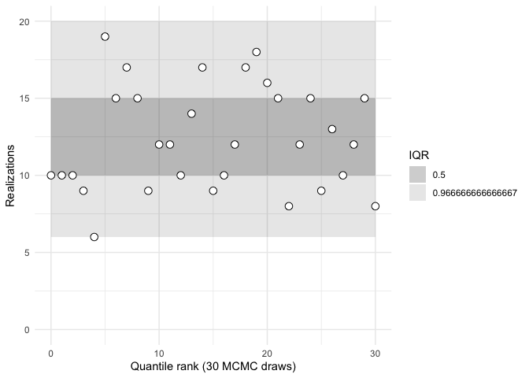

<!-- README.md is generated from README.Rmd. Please edit that file -->

# sbcrs

<!-- badges: start -->

<!-- badges: end -->

This package provides tools to simplify the implementation of simulation
based calibration using rank statistics (Talts, Betancourt, Simpson,
Vehtari, and Gelman,
[arXiv:1804.06788](https://arxiv.org/abs/1804.06788)). It implements a
very similar validation procedure to that in `rstan::sbc` but using a
different workflow. In `rstan::sbc`, the Stan model must be modified by
the user to generate rank statistics during sampling. In this package,
the Stan model is left unmodified, and the code needed to calculate the
rank statistics is written in R. This provides a potentially faster
development workflow (Stan recompiles are not needed). It also allows
SBC to be used in cases where generating parameters from their prior
distributions, or the modeled variable from the likelihood function,
would be too complicated if written in
Stan.

## Installation

<!-- You can install the released version of sbcrs from [CRAN](https://CRAN.R-project.org) with: -->

<!-- ``` r -->

<!-- install.packages("sbcrs") -->

<!-- ``` -->

You can install the development version from
[GitHub](https://github.com/) with:

``` r
# install.packages("devtools")
devtools::install_github("jasonmtroos/sbcrs")
```

To build the package vignettes, install the package using:

``` r
devtools::install_github("jasonmtroos/sbcrs", build_vignettes = TRUE)
```

The package vignettes are a useful starting point for understanding what
this package does:

  - `intro-to-sbc` provides an overview to simulation-based calibration,
    and the features of the SBC package

  - `funnel` shows how SBC identified sampling problems in Neal’s funnel

  - `comparison-to-rstan-sbc` implements the example from `rstan::sbc`
    using this package, shows the rank statistics are the same, and
    provides a basis for understanding the different design philosophies
    behind the two approaches.

It is also useful to understand why this package does what it does. For
that, see: [Validating Bayesian Inference Algorithms with
Simulation-Based Calibration,
arXiv:1804.06788](https://arxiv.org/abs/1804.06788).

## A Simple Illustration of What This Thing Does

``` r
library(rstan)
#> Loading required package: StanHeaders
#> Loading required package: ggplot2
#> rstan (Version 2.19.2, GitRev: 2e1f913d3ca3)
#> For execution on a local, multicore CPU with excess RAM we recommend calling
#> options(mc.cores = parallel::detectCores()).
#> To avoid recompilation of unchanged Stan programs, we recommend calling
#> rstan_options(auto_write = TRUE)
my_model <- stan_model(model_code = "
data {
  vector[100] y;
  vector[100] x;
  vector[100] w;
}
parameters {
  real alpha;
  real beta;
  real<lower = 0> sigma;
}
model {
  alpha ~ std_normal();
  beta ~ std_normal();
  sigma ~ exponential(1);
  y ~ normal(alpha + beta * x + beta^2 * w, sigma);
}
")
```

How can we be sure this Stan model is able to sample from the posterior
distribution of `alpha`, `beta`, and `sigma`? [Read the
paper\!](https://arxiv.org/abs/1804.06788)

Here’s the code:

``` r
library(sbcrs)
doParallel::registerDoParallel(parallel::detectCores())
x <- sample.int(5, 100, replace = TRUE)
w <- rnorm(100)
my_sbc <- SBC$new(
  data = function(seed) {
    list(w = w, x = x)
  },
  params = function(seed, data) {
    set.seed(seed + 1e6)
    alpha <- rnorm(1)
    beta <- rnorm(1)
    sigma <- rexp(1)
    list(alpha = alpha, beta = beta, sigma = sigma)
  },
  modeled_variable = function(seed, data, params) {
    set.seed(seed + 2e6)
    list(y = rnorm(100, params$alpha + 
                     params$beta * data$x + 
                     params$beta^2 * data$w, params$sigma))
  },
  sampling = function(seed, data, params, modeled_variable, iters) {
    data_for_stan <- c(data, modeled_variable)
    rstan::sampling(my_model, data = data_for_stan, seed = seed,
                    chains = 1, iter = 2 * iters, warmup = iters,
                    refresh = 200)
  }
)
my_sbc$calibrate(N = 128, L = 30, keep_stan_fit = FALSE)
my_sbc$plot()
```



``` r
my_sbc$summary()
#> 
#> 
#>         iq expected.outside actual.outside
#>  0.5000000       0.50000000     0.32258065
#>  0.9666667       0.03333333     0.06451613
```

Looks good\!
