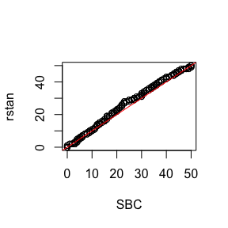

```{r, include = FALSE}
knitr::opts_chunk$set(
  collapse = TRUE,
  comment = "#>"
)
```


```{r setup}
library(sbcrs)
library(rstan)
```


```{r include = FALSE, echo = FALSE, message = FALSE}
rstan::rstan_options("auto_write" = TRUE)
get_compiled_stan_model <- function(filename) {
  m <- NULL
  stan_file_loc <- here::here('inst', 'stan', filename)
  if (file.exists(stan_file_loc)) {
    m <- stan_model(file = stan_file_loc, save_dso = TRUE)
  }
  if (is.null(m)) {
    m <- stan_model(file = system.file('stan', filename, package = 'sbcrs'))
  }
  m
}
sbc_rstan_model <- get_compiled_stan_model('rstan_sbc_example.stan')
sbc_original_model <- get_compiled_stan_model('rstan_sbc_example_original.stan')
```

We will compare the ranks calculated using the SBC package against those calculated by the `rstan::sbc()` function. 

The stan code for this model is based on the help text for `rstan::sbc`. The following model is given as an example:

```{r eval = TRUE, output = 'as_is', echo = FALSE, comment = ""}
cat(readr::read_file(system.file('stan', 'rstan_sbc_example.stan', package = 'sbcrs')))
```

Compile this Stan model:

```{r eval = FALSE}
sbc_rstan_model <- stan_model(file = system.file('stan', 'rstan_sbc_example.stan', package = 'sbcrs'))
```

Calibrate using `rstan::sbc()`.

```{r eval = FALSE}
options(mc.cores = (if (interactive()) parallel::detectCores() else 2))
calibration_data <- list(N = 10, a = 2, b = 2)
rstan_sbc <- rstan::sbc(sbc_rstan_model, data = calibration_data, 256)
plot(rstan_sbc, binwidth = 1, thin = 50)
```


The Stan code used in the above example has been modified from the original. In the modified version, `y` is generated  in the `transformed data` block of the Stan file. The original model would have looked like this:

```{r eval = TRUE, output = 'as_is', echo = FALSE, comment = ""}
cat(readr::read_file(system.file('stan', 'rstan_sbc_example_original.stan', package = 'sbcrs')))
```

Compile this Stan model:

```{r eval = FALSE}
sbc_original_model <- stan_model(file = system.file('stan', 'rstan_sbc_example_original.stan', package = 'sbcrs'))
```

Create an SBC object that corresponds with the original model.

```{r}
sbc <- SBC$new(
  data = function(seed) {
    calibration_data
  },
  params = function(seed, data) {
    set.seed(seed + 1e6)
    list(pi = rbeta(1, data$a, data$b))
  },
  modeled_data = function(seed, data, params) {
    set.seed(seed + 2e6)
    list(y = rbinom(1, data$N, params$pi))
  },
  sampling = function(seed, data, params, modeled_data, iters) {
    sampling(sbc_original_model, data = c(data, modeled_data), seed = seed,
             chains = 1, iter = 2 * iters, warmup = iters)
  })
```

```{r eval = FALSE}
doParallel::registerDoParallel(cores = (if (interactive()) parallel::detectCores() else 2))
sbc$calibrate(256, 50)
sbc$plot()
```


Assess whether the distributions of recovered ranks are similar

```{r eval = FALSE}
library(purrr)
x <- 
  map(sbc$calibrations, 'ranks') %>%
  flatten() %>%
  unlist() %>%
  unname()

y <- 
  rstan_sbc$ranks %>%
  map(~.x[seq(1, 1000, by = 20), ]) %>%
  map(~sum(.x)) %>%
  unlist()

qqplot(x, y, xlab = 'SBC', ylab = 'rstan')
abline(a = 0, b = 1, col = 'red')
```



```{r eval = FALSE}
wilcox.test(x, y)
```
```r
#> 
#> 	Wilcoxon rank sum test with continuity correction
#> 
#> data:  x and y
#> W = 30819, p-value = 0.2443
#> alternative hypothesis: true location shift is not equal to 0
```

