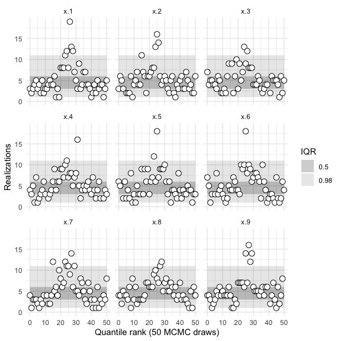
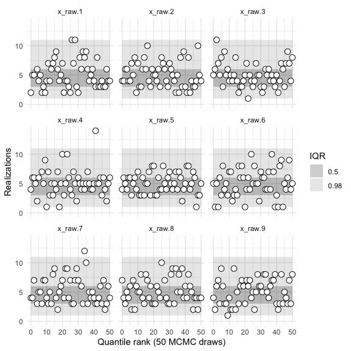
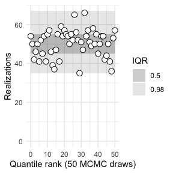
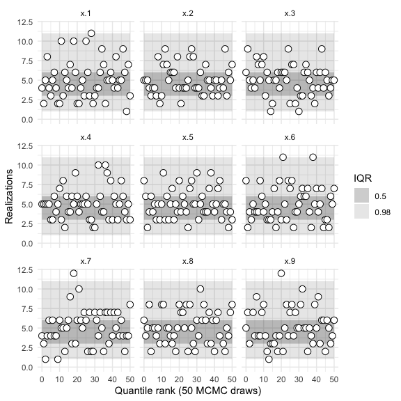

```{r, include = FALSE}
knitr::opts_chunk$set(
  collapse = TRUE,
  comment = "#>"
)
```


```{r setup}
library(sbcrs)
library(rstan)
```


```{r include = FALSE, echo = FALSE, message = FALSE, eval = FALSE}
rstan::rstan_options("auto_write" = TRUE)
get_compiled_stan_model <- function(filename) {
  m <- NULL
  stan_file_loc <- here::here('inst', 'stan', filename)
  if (file.exists(stan_file_loc)) {
    m <- stan_model(file = stan_file_loc, save_dso = TRUE)
  }
  if (is.null(m)) {
    m <- stan_model(file = system.file('stan', filename, package = 'sbcrs'))
  }
  m
}
funnel <- get_compiled_stan_model('funnel.stan')
funnel_reparameterized <- get_compiled_stan_model('funnel_reparameterized.stan')
```

In this example, we will calibrate two versions of Neal's funnel.[^1] 

[^1]: Both versions of the model are from https://mc-stan.org/docs/2_20/stan-users-guide/reparameterization-section.html

$$
p(y,x) = \mathsf{normal}(y|0,3) * \prod_{n=1}^9 \mathsf{normal}(x_n|0,\exp(y/2))
$$

When parameterized in terms of $x_n$ and $y$, this model is extremely difficult for Stan to sample from. Per the Stan User's Guide: "The probability contours are shaped like ten-dimensional funnels. The funnel’s neck is particularly sharp because of the exponential function applied to  $y$." Ideally, simulation-based calibration should detect the sampling pathologies in this model.

The stan code for this model (without re-parameterization) is:

```{r eval = TRUE, output = 'as_is', echo = FALSE, comment = ""}
cat(readr::read_file(system.file('stan', 'funnel.stan', package = 'sbcrs')))
```

Compile the Stan model:

```{r eval = FALSE}
funnel <- stan_model(file = system.file('stan', 'funnel.stan', package = 'sbcrs'))
```

Create an SBC object called `sbc1` with functions to: 1) generate simulated values of `x` and `y`, and 2) call `rstan::sampling`, passing in `funnel` as the model to be sampled.

```{r eval = FALSE}
sbc1 <- SBC$new(
  params = function(seed, data) {
    set.seed(seed + 10)
    y <- rnorm(1, 0, 3)
    x <- rnorm(9, 0, exp(y/2))
    list(y = y, x = x)
  }, 
  sampling = function(seed, data, params, modeled_data, iters) {
    sampling(funnel, data = data, seed = seed, chains = 1, iter = 2 * iters, warmup = iters)
  })
```

Perform the calibration (this may take a long time, so take advantage of parallelization).

```{r eval = FALSE}
doParallel::registerDoParallel(cores = parallel::detectCores())
sbc1$calibrate(N = 256, L = 50)
sbc1$plot()
```


```{r eval = FALSE}
sbc1$plot('y')
```


```{r fig.width=6, fig.height=6, eval = FALSE}
sbc1$plot('x')
```



```{r eval = FALSE}
sbc1$summary()
```

```r
#> 
#> 
#>    iq expected.outside actual.outside
#>  0.50             0.50      0.7647059
#>  0.98             0.02      0.4117647
```


The model is evidently poorly conditioned.

The reparameterized model is based on new primitives: `x_raw` and `y_raw`, which follow independent, standard normal distributions. From these newly defined primitives, it then builds up `x` and `y` based on their analytical definitions (see above). The stan code for the reparameterized model is:

```{r eval = TRUE, output = 'as_is', echo = FALSE, comment = ""}
cat(readr::read_file(system.file('stan', 'funnel_reparameterized.stan', package = 'sbcrs')))
```

Compile the (reparameterized) Stan model:

```{r eval = FALSE}
funnel_reparameterized <- stan_model(file = system.file('stan', 'funnel_reparameterized.stan', package = 'sbcrs'))
```

Create an SBC object called `sbc2a` with functions to: 1) generate simulated values of `x_raw` and `y_raw`, and 2) call `rstan::sampling`, passing in `funnel_reparameterized` as the model to be sampled.

```{r eval = FALSE}
sbc2a <- SBC$new(
  params = function(seed, data) {
    set.seed(seed + 10)
    y_raw <- rnorm(1, 0, 1)
    x_raw <- rnorm(9, 0, 1)
    list(y_raw = y_raw, x_raw = x_raw)
  }, 
  sampling = function(seed, data, params, modeled_data, iters) {
    sampling(funnel_reparameterized, data = data, seed = seed, chains = 1, iter = 2 * iters, warmup = iters)
  })
```

Perform the calibration.

```{r eval = FALSE}
sbc2a$calibrate(N = 256, L = 50)
sbc2a$plot()
```


```{r eval = FALSE}
sbc2a$plot('y_raw')
```


```{r fig.width=6, fig.height=6, eval = FALSE}
sbc2a$plot('x_raw')
```



```{r eval = FALSE}
sbc2a$summary()
```

```r
#>
#> 
#>    iq expected.outside actual.outside
#>  0.50             0.50      0.4313725
#>  0.98             0.02      0.0000000
```

Rather than comparing simulated and sampled values of `x_raw` and `y_raw`, we might instead wish to compare `x` and `y`. In the code that creates the object `sbc2b`, note that the `params()` function returns a list with named values `x` and `y`. Hence the calibration is performed on those parameters.

```{r eval = FALSE}
sbc2b <- SBC$new(
  params = function(seed, data) {
    set.seed(seed + 10)
    y_raw <- rnorm(1, 0, 1)
    x_raw <- rnorm(9, 0, 1)
    y <- 3.0 * y_raw;
    x <- exp(y/2) * x_raw;
    list(x = x, y = y)
  }, 
  sampling = function(seed, data, params, modeled_data, iters) {
    sampling(funnel_reparameterized, data = data, seed = seed, chains = 1, iter = 2 * iters, warmup = iters)
  })
```

Perform the calibration.

```{r eval = FALSE}
sbc2b$calibrate(N = 256, L = 50)
sbc2b$plot()
```



```{r eval = FALSE}
sbc2b$plot('y')
```


```{r fig.width=6, fig.height=6, eval = FALSE}
sbc2b$plot('x')
```



```{r eval = FALSE}
sbc2b$summary()
```

```r
#>
#> 
#>    iq expected.outside actual.outside
#>  0.50             0.50      0.3921569
#>  0.98             0.02      0.0000000
```

